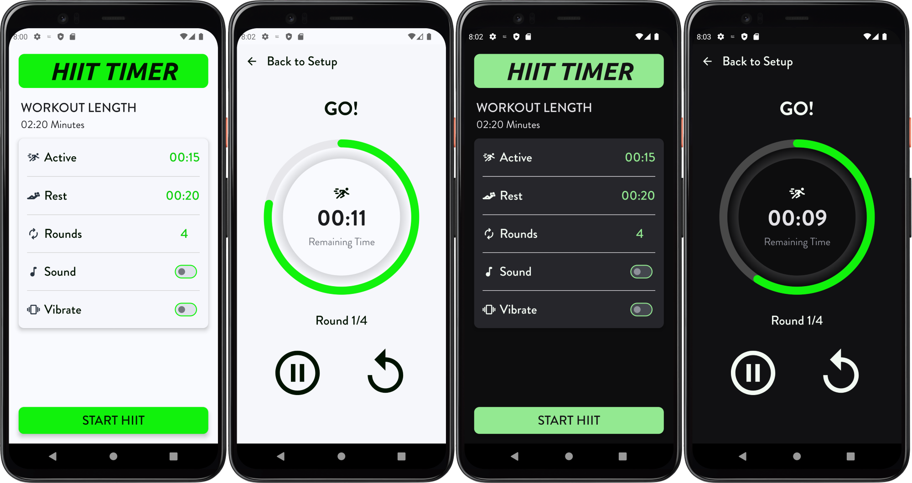

## Table of Contents

- [Overview](#overview)
    - [The Challenge](#the-challenge)
    - [Screenshots](#screenshots)
- [My Process](#my-process)
    - [Built With](#built-with)
    - [What I Learned](#what-i-learned)
    - [Continued Development](#continued-development)
- [Author](#author)

## Overview

### The Challenge

The goal of this project is to create a timer application that allows users to:

- Set active and rest intervals with customizable durations.
- Track rounds of activity and rest periods.
- Use sound and vibration notifications to signal the end of intervals.
- Handle different timer types such as preparation, active, and rest.

### Screenshots

#### Timer Screen

### Links

- Solution URL: [Solution](https://github.com/mlzzi/HiitTimerApp)

## My Process

### Built With

- Android Studio
- Kotlin
- Jetpack Compose
- StateFlow
- MVVM

### What I Learned

Through this project, I gained hands-on experience with state management in Jetpack Compose using `StateFlow` and `ViewModel`. I learned how to manage user interactions with a timer, implement sound and vibration features, and create a responsive UI that adapts to different screen sizes. This project enhanced my understanding of Android development principles and best practices.

### Continued Development

I plan to further improve this application by exploring advanced features such as:

- Implementing a history feature to track past timer sessions.
- Enhancing the UI with animations and better visual feedback.
- Implement calories burned from exercise setup

## Author

- LinkedIn - [Murilo Luzzi](https://www.linkedin.com/in/muriloluzzi/)
- GitHub - [@mlzzi](https://github.com/mlzzi)
